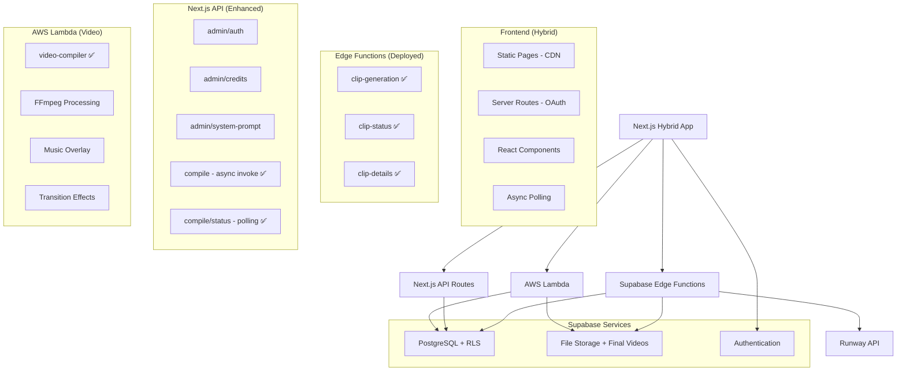

# System Patterns - Echoes Video Creator

## Architecture Overview (Hybrid Deployment Model) ✅ COMPLETED



### Architecture Decision: Hybrid Backend Strategy ✅

**❌ Why Next.js API Routes Failed (For Core Logic):**
- Poor debugging experience (console.log in terminal only)
- Difficult error tracking and monitoring
- Server deployment complexity
- Serverless function limitations (timeouts, memory)

**✅ Why Supabase Edge Functions Are Better (For Core Logic):**
- Built-in logging dashboard with real-time monitoring
- Structured error tracking and stack traces
- Automatic scaling and reliability
- Integrated with Supabase ecosystem
- Deno runtime with modern JavaScript features

**✅ Why AWS Lambda Is Perfect (For Video Processing):**
- No timeout limitations with async invocation
- Large memory allocation (up to 10GB)
- Custom runtime with embedded FFmpeg binaries
- Cost-effective for compute-intensive operations
- Mature ecosystem with AWS SDK integration

**✅ Migration & Implementation Results:**
- **3 Edge Functions deployed**: clip-generation, clip-status, clip-details
- **1 AWS Lambda deployed**: video-compiler with embedded FFmpeg
- **Async processing workflow**: API Gateway timeout bypassed
- **Superior debugging achieved**: Real-time dashboard monitoring + CloudWatch logs
- **Frontend integration complete**: ClipGeneration.tsx + async compilation
- **Authentication working**: JWT tokens properly passed
- **Build process verified**: TypeScript compilation successful

### Deployment Strategy: Hybrid Next.js Model

**❌ Why Not Static Export:**
- OAuth callback `/auth/callback` requires server-side execution
- Session management needs secure cookie handling
- Authentication security cannot be compromised

**✅ Why Hybrid Deployment:**
- Static pages served from CDN (performance)
- Server routes for secure operations (security) 
- Platform-optimized deployment (Vercel/Netlify)
- Best of both worlds: speed + functionality

## Core Design Patterns

### 1. Async Processing Pattern
```typescript
// Video compilation with async Lambda invocation
interface VideoCompilationRequest {
  clips: Clip[]
  music?: MusicTrack
  transitions: TransitionType
  settings: CompilationSettings
}

// Async workflow
const compileVideo = async (request: VideoCompilationRequest) => {
  // 1. Create processing record immediately
  const processingRecord = await createProcessingRecord(request)
  
  // 2. Invoke Lambda asynchronously (no timeout)
  await invokeLambdaAsync(processingRecord.id, request)
  
  // 3. Return processing ID for polling
  return { video_id: processingRecord.id, status: 'processing' }
}

// Status polling with token refresh
const pollVideoStatus = async (videoId: string) => {
  // Poll every 5 seconds with fresh session tokens
  // Handle completion, errors, and timeouts
}
```

### 2. Auth-First Pattern
```typescript
// All routes protected by default
export default function ProtectedLayout({ children }: { children: React.ReactNode }) {
  const { user } = useUser()
  if (!user) return <RedirectToLogin />
  return children
}
```

### 3. Credit System Pattern
```typescript
interface CreditTransaction {
  user_id: string
  amount: number        // positive = credit, negative = debit
  type: 'purchase' | 'referral' | 'generation' | 'share'
  reference_id?: string // stripe payment, project id, etc.
}
```

### 4. Clip Approval Pattern
```typescript
interface Clip {
  id: string
  project_id: string
  image_url: string
  video_url: string
  status: 'generating' | 'ready' | 'error'
  approved: boolean    // User must approve each clip
  order: number       // Maintain sequence
}
```

### 5. Sequential Player Pattern
```typescript
interface Project {
  id: string
  clips: Clip[]       // Ordered by clip.order
  music_url?: string
  status: 'in_progress' | 'completed'
}

// No video stitching - play clips in sequence
class SequentialPlayer {
  playClips(clips: Clip[]) {
    // Play approved clips in order
    // Handle transitions
    // Sync with music
  }
}
```

### 6. Pluggable AI Pattern
```typescript
interface AIProvider {
  generateClip(imageUrl: string, prompt: string): Promise<string>
  getJobStatus(jobId: string): Promise<JobStatus>
}

// Configurable via admin
const ACTIVE_PROVIDER = process.env.ACTIVE_AI_PROVIDER || 'runway'
```

## Data Flow Patterns

### Complete Video Generation Flow
```
Photo Upload → Edge Functions → Runway API → Clip Storage
     ↓
Finalization Page → Clip Selection → Music Choice
     ↓
Async Lambda Compilation → Status Polling → Dashboard Display
```

### Auth-First Flow
```
Landing Page → Google OAuth → Upload Wizard (1 Free Credit)
     ↓
Credit Check → Generate Clip → Preview & Approve
     ↓
Add to Project → Continue or Purchase More Credits
```

### Clip Generation Flow
```
Upload → Private Storage → Edge Function → AI Provider
     ↓
Status Updates → Frontend Polling → Preview & Approve
     ↓
Add to Sequence → Update Project Order
```

### Video Compilation Flow
```
Finalize Page → Create Processing Record → Async Lambda Invoke
     ↓
Lambda: FFmpeg Processing → Music Overlay → Transitions
     ↓
Upload to Storage → Update Database → Status Polling Complete
     ↓
Frontend Redirect → Dashboard Final Videos → Download/Share
```

### Payment Flow
```
Stripe Checkout → Webhook → Credit Addition → Transaction Log
     ↓
Real-time Balance Update → UI Refresh → Feature Unlock
```

## Security Patterns

### Row Level Security (RLS)
```sql
-- Users can only access their own data
CREATE POLICY "auth_only" ON storage.objects
  FOR ALL USING (auth.role() = 'authenticated');

-- Users can only access their own clips
CREATE POLICY "user_clips" ON clips
  FOR ALL USING (auth.uid() = user_id);
```

### Storage Security
```typescript
// All storage is private, accessed via signed URLs
const { data } = await supabase.storage
  .from('private')
  .createSignedUrl(filePath, 3600)
```

## Error Handling Patterns

### Progressive Error Recovery
1. **Auth Errors**: Redirect to login
2. **Upload Errors**: Retry with smaller chunks
3. **Generation Errors**: Clear error state, allow new upload
4. **Payment Errors**: Maintain cart state, retry

## Performance Patterns

### Lazy Loading
- Components loaded on demand
- Clips loaded sequentially
- Music preloaded for smooth playback

### Caching Strategy
- Auth state cached
- Approved clips cached
- Project metadata cached

### Mobile Optimization
- Image compression before upload
- Progressive loading
- Touch-friendly controls 