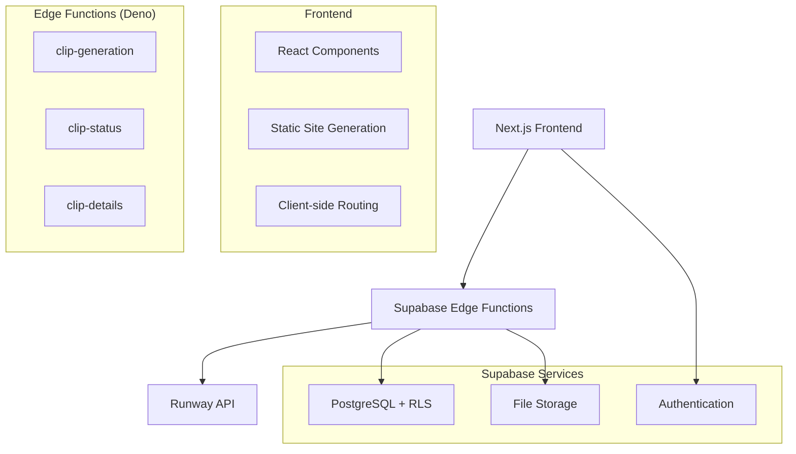

# System Patterns - Echoes Video Creator

## Architecture Overview (Updated - Edge Functions)



### Architecture Decision: Edge Functions vs Next.js API Routes

**❌ Why Next.js API Routes Failed:**
- Poor debugging experience (console.log in terminal only)
- Difficult error tracking and monitoring
- Server deployment complexity
- Serverless function limitations (timeouts, memory)

**✅ Why Supabase Edge Functions Are Better:**
- Built-in logging dashboard with real-time monitoring
- Structured error tracking and stack traces
- Automatic scaling and reliability
- Integrated with Supabase ecosystem
- Deno runtime with modern JavaScript features

## Core Design Patterns

### 1. Auth-First Pattern
```typescript
// All routes protected by default
export default function ProtectedLayout({ children }: { children: React.ReactNode }) {
  const { user } = useUser()
  if (!user) return <RedirectToLogin />
  return children
}
```

### 2. Credit System Pattern
```typescript
interface CreditTransaction {
  user_id: string
  amount: number        // positive = credit, negative = debit
  type: 'purchase' | 'referral' | 'generation' | 'share'
  reference_id?: string // stripe payment, project id, etc.
}
```

### 3. Clip Approval Pattern
```typescript
interface Clip {
  id: string
  project_id: string
  image_url: string
  video_url: string
  status: 'generating' | 'ready' | 'error'
  approved: boolean    // User must approve each clip
  order: number       // Maintain sequence
}
```

### 4. Sequential Player Pattern
```typescript
interface Project {
  id: string
  clips: Clip[]       // Ordered by clip.order
  music_url?: string
  status: 'in_progress' | 'completed'
}

// No video stitching - play clips in sequence
class SequentialPlayer {
  playClips(clips: Clip[]) {
    // Play approved clips in order
    // Handle transitions
    // Sync with music
  }
}
```

### 5. Pluggable AI Pattern
```typescript
interface AIProvider {
  generateClip(imageUrl: string, prompt: string): Promise<string>
  getJobStatus(jobId: string): Promise<JobStatus>
}

// Configurable via admin
const ACTIVE_PROVIDER = process.env.ACTIVE_AI_PROVIDER || 'runway'
```

## Data Flow Patterns

### Auth-First Flow
```
Landing Page → Google OAuth → Upload Wizard (1 Free Credit)
     ↓
Credit Check → Generate Clip → Preview & Approve
     ↓
Add to Project → Continue or Purchase More Credits
```

### Clip Generation Flow
```
Upload → Private Storage → Edge Function → AI Provider
     ↓
Status Updates → Frontend Polling → Preview & Approve
     ↓
Add to Sequence → Update Project Order
```

### Payment Flow
```
Stripe Checkout → Webhook → Credit Addition → Transaction Log
     ↓
Real-time Balance Update → UI Refresh → Feature Unlock
```

## Security Patterns

### Row Level Security (RLS)
```sql
-- Users can only access their own data
CREATE POLICY "auth_only" ON storage.objects
  FOR ALL USING (auth.role() = 'authenticated');

-- Users can only access their own clips
CREATE POLICY "user_clips" ON clips
  FOR ALL USING (auth.uid() = user_id);
```

### Storage Security
```typescript
// All storage is private, accessed via signed URLs
const { data } = await supabase.storage
  .from('private')
  .createSignedUrl(filePath, 3600)
```

## Error Handling Patterns

### Progressive Error Recovery
1. **Auth Errors**: Redirect to login
2. **Upload Errors**: Retry with smaller chunks
3. **Generation Errors**: Clear error state, allow new upload
4. **Payment Errors**: Maintain cart state, retry

## Performance Patterns

### Lazy Loading
- Components loaded on demand
- Clips loaded sequentially
- Music preloaded for smooth playback

### Caching Strategy
- Auth state cached
- Approved clips cached
- Project metadata cached

### Mobile Optimization
- Image compression before upload
- Progressive loading
- Touch-friendly controls 